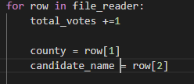
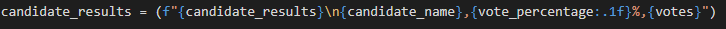
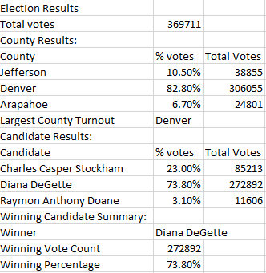

# Election Audit Using Python
## Contents
- [Election Audit Using Python](#election-audit-using-python)
  - [Contents](#contents)
  - [Overview of the Project](#overview-of-the-project)
  - [Files](#files)
  - [Election Audit Results](#election-audit-results)
  - [Election Audit Summary](#election-audit-summary)

## Overview of the Project
The purpose of this project is to assist a Colorado Board of Elections employee in auditing election results across three different counties. The task involves estimating and reporting results for each of the candidate and county involved. Election data is available in a csv file and Python was used to read the data and compute results.

## Files
1. PyPoll_Challenge - Contains the Python election analysis code to extract information by county and candidate.
2. PyPoll_Challenge_ExcelMod - Slight variation of the challenge code to print results in a csv friendly format.

## Election Audit Results
Following is a summary of the congressional election across Denver, Jefferson and Arapahoe counties:
* Total votes cast: 369,711
* Results by county:
    * Jefferson: 10.5% of total votes (38,855)
    * Denver: 82.8% of total votes (306,055)
    * Arapahoe: 6.7% of total votes (24,801)
* County with most votes: Denver
* Candidate results:
    * Charles Casper Stockham: 23.0% of total votes (85,213)
    * Diana DeGette: 73.8% of total votes (272,892)
    * Raymon Anthony Doane: 3.1% of total votes (11,606)
* Winning candidate summary:
    * Winner: Diana DeGette
    * Winning Vote Count: 272,892
    * Winning Percentage: 73.8%

## Election Audit Summary
A Python code was successfully developed for computing and tabulating election results. The code can be used for any number of counties and candidates, as long as the data is input in the same format as the existing input csv file. However, with slight modifications, the code can be extended for use with other elections. Here are two ways the script can be modified to make it more usable:

1\. The csv file can include additional columns of data. If the structure of the existing csv file changes, then the following lines of code shown below need to be modified to include the appropriate index.

 

Depending on how the columns are organized, the county and candidate_name variables need to be modified to point to the right column. Similarly, additional variables to track other columns can be created and assigned the right row[] index.

2\. The current output printed to the text file cannot be directly used for further calculations due to the way it is formatted. Modifying the format so that the results can directly be opened in Excel should be more useful. An example line of code with the updated format for variables written to a csv file is shown below:

The corresponding csv output now opened in Excel is shown below:

